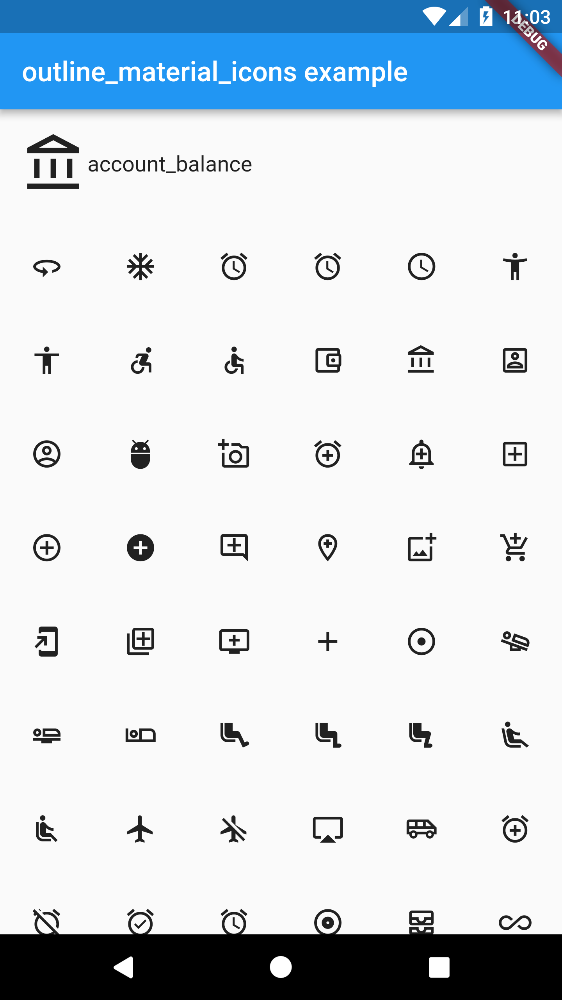

# outline_material_icons

This package provides the 'outline' theme of icons on the [Material Design website](https://material.io/tools/icons/), which is not available in Flutter or as a .ttf font file.



These icons were downloaded in September 2018, they may be updated in the future.

## Usage

Add the package to pubspec.yaml and use the OMIcons class.

```
  Widget build(BuildContext context) => Icon(OMIcons.sentimentSatisfied);
```

Browse available icons using the example app or the Material Design icons website above.

There is a ```Map<String, int>``` of snake_case icon names to codepoints if you want to list all the icons. See the example app code for how. Using the OMIcons class directly is preferable in most cases.

## Changes and omissions

All 'partly filled' icons are removed due to single colour restriction for .ttf fonts. This includes partly-filled battery icons and not-full-strength wifi/reception icons.

Icons with an underline have had the line made solid: border_color, format_color_fill and format_color_text.

These icons were renamed to avoid Dart errors/clashes: 360 -> icon360, class -> classIcon, sync -> syncIcon

## Getting Started

For help getting started with Flutter, view our online [documentation](https://flutter.io/).

For help on editing package code, view the [documentation](https://flutter.io/developing-packages/).
